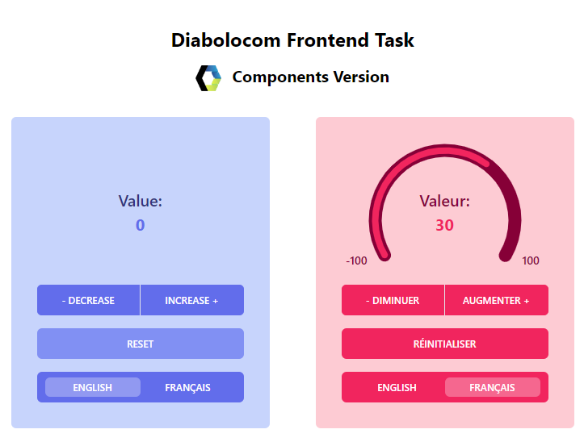

# Diabolocom Frontend Task


This project is a demonstration of specific components development using [ViteJS](https://vitejs.dev/), [VueJS](https://vuejs.org/), [TypeScript](https://www.typescriptlang.org/) and [TailwindCSS](https://tailwindcss.com/).

- [Full requirements for the task](docs/REQUIREMENTS.md)
- [Development process](docs/DEVELOPMENT_PROCESS.md)
- [How to use the components](docs/HOWTO.md)

## Project Setup

First, clone this repo:

```sh
# With GitHub CLI
gh repo clone doic/diabolocom-frontend-task

# Or with git CLI
git clone https://github.com/doic/diabolocom-frontend-task.git
```

Install all dependencies:

```sh
npm install
```

On Mac, if you run into an error about `canvas` package, you can fix it this way:

```sh
brew install pkg-config cairo pango libpng jpeg giflib librsvg
```

```sh
brew update
```

```sh
brew upgrade
```

```sh
npm i
```

### Run Development Server

If you want to tweak the components

```sh
npm run dev
```

See [how to use the components](docs/HOWTO.md)

### Build Options

This command will build both Vue components and Web components:

```sh
npm run build
```

You can choose which components to build:

```sh
# Build only Vue components:
npm run build-vue

# Build only Web components:
npm run build-wc
```

### Run Unit Tests with [Vitest](https://vitest.dev/)

```sh
npm run test:unit
```

### Run E2E Tests with [Playwright](https://playwright.dev)

```sh
# Install browsers for the first run
npx playwright install

# Build the project before running the e2e tests
npm run build

# Runs the e2e tests
npm run test:e2e
# Runs the tests only for Vue components
npm run test:e2e -- vue.spec.ts
# Runs the tests only for Web components
npm run test:e2e -- wc.spec.ts
```

### See the components live

| [](https://diabolocom-frontend-task.vercel.app/)  | [](https://diabolocom-frontend-task-wc.vercel.app/)  |
| --------------------------------------------------------------------------------- | ---------------------------------------------------------------------------------- |
| <center>[VueJs components](https://diabolocom-frontend-task.vercel.app/)</center> | <center>[Web components](https://diabolocom-frontend-task-wc.vercel.app/)</center> |
